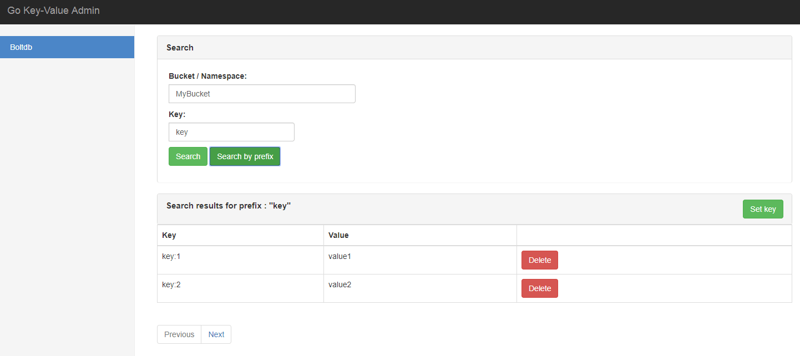

# Go Key-Value Admin
Gokvadmin is a minimalistic web interface for managing key-value databases.
It offers adding, deleting and searching for keys.

Gokvadmin allows plugging custom engines for all your enginy needs ;)



## Installing
To start using Gokvadmin, install Go 1.8 or above and run `go get`:
```sh
$ go get github.com/sigurniv/gokvadmin
```

## Supported engines
Currently Gokvadmin supports a few embedded key-value databases:
* [BoltDB](https://github.com/boltdb/bolt)
* [Badger](https://github.com/dgraph-io/badger)

## Usage
Embedded storages often obtain a lock on the data files/directories. Gokvadmin allows to reuse currently existing
database connection, which makes it possible to use it with running application.

Gokvadmin starts `net/http` webserver at `:8083` by default and serves static files from 
`$GOPATH/github.com/sigurniv/gokvadmin/assets` folder.

### Simple Usage
```go
package main

import (
	"github.com/sigurniv/gokvadmin"
)

func main() {
  // Create database connection
  db := ... // *bolt.DB
  
  //Use default gokvadmin config
  config := gokvadmin.DefaultConfig
  admin, _ := gokvadmin.NewGoKVAdmin("boltdb", db, config)
  go admin.Run() // listen and serve on 0.0.0.0.:8083
}
```
### Configuring server
Gokvadmin uses [gorilla/mux](https://github.com/gorilla/mux) and [net/http](https://golang.org/pkg/net/http/) internally.
Both router and server available under Router and Server fields of gokvadmin struct respectively.
This allows customization of both for your needs.

```go
package main

import (
	"github.com/sigurniv/gokvadmin"
	"time"
)

func main() {
  // Create database connection
  db := ... // *bolt.DB
  
  config := gokvadmin.DefaultConfig
  admin, _ := gokvadmin.NewGoKVAdmin("boltdb", db, config)
  
  //Customize the Server instance
  admin.Server.Addr = ":3001"
  admin.Server.WriteTimeout =  time.Second * 15
  go admin.Run() // listen and serve on 0.0.0.0.:3001
}
```

### Authentication
By default Gokvadmin uses no authentication so anyone can login into the dashboard, but you can add login/password authentication.
 
```go
package main

import (
	"github.com/sigurniv/gokvadmin"
)

func main() {
  // Create database connection
  db := ... // *bolt.DB

  config := gokvadmin.DefaultConfig
  config.Auth = &gokvadmin.Auth{
 		Login:"login",
 		Password:"password",
  }
  admin, _ := gokvadmin.NewGoKVAdmin("boltdb", db, config) 
  go admin.Run() // listen and serve on 0.0.0.0.:8083
}
```
### TLS
To use TLS you need to pass `TLS` struct to config object
```go
package main

import (
	"github.com/sigurniv/gokvadmin"
)

func main() {
  // Create database connection
  db := ... // *bolt.DB

  config := gokvadmin.DefaultConfig
  config.TLS = &gokvadmin.TLS{
  		CertFile: "server.crt",
  		KeyFile: "server.key",
  }
  admin, _ := gokvadmin.NewGoKVAdmin("boltdb", db, config) 
  go admin.Run() // listen and serve on 0.0.0.0.:8083
}
```

## Custom engines
You can add your custom engine to use with Gokvadmin. All you need to do is implement the 
[Engine interface](https://github.com/sigurniv/gokvadmin/blob/master/engine.go) and register it.

```go
package main

import (
	"github.com/sigurniv/gokvadmin"
)

func main() {
  // Create database connection
  db := ... // Your db connection
 
  //Use your custom engine
  gokvadmin.RegisterEngine("custom_engine", &YourCustomEgine{})
  config := gokvadmin.DefaultConfig
  admin, _ := gokvadmin.NewGoKVAdmin("custom_engine", db, config) 
  go admin.Run() // listen and serve on 0.0.0.0.:8083
}
```
## Customizing frontend
Gokvadmin uses [Vue.js](https://vuejs.org/) for frontend. Its is possible to customize a layout for you custom engine.
Gokvadmin comes with bundled `assets/dist/build.js` and `assets/dist/bootstrap.min.css` files. It uses vue.js webpack-simple 
template so all you need to do to start coding the frontend part is:

```sh
$ npm init
$ npm run dev
```

Create your custom component in `assets/src/engines` folder and register it in `assets/src/store/modules/engines.js` file. 

```javascript
import YourCustomEngineComponent from '../../components/engines/YourCustomEngineComponent.vue';

const state = {
    engines: {
        'default': General,
        'boltdb': General,
        'badger': General,
        "custom_engine": YourCustomEngineComponent
    },
    ...
};
```
To add custom routes your engine must implement [RouterEngine](https://github.com/sigurniv/gokvadmin/blob/master/engine.go) interface

```go
func (e CustomEngine) AddRoutes(r *mux.Router) {
	r.HandleFunc("/api/custom-engine/hello", func(w http.ResponseWriter, r *http.Request) {
		w.Header().Set("Content-Type", "application/json")
		w.Write([]byte("hello from custome-engine"))
		return
	}).Methods(http.MethodGet)
}
```


